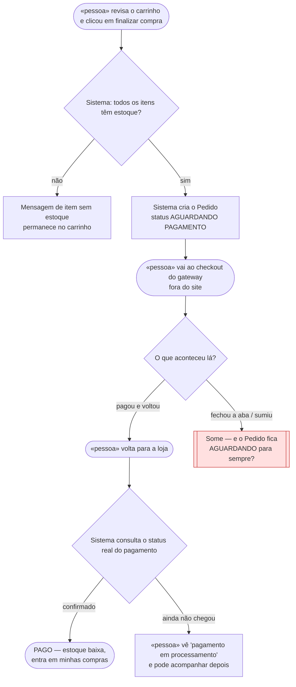
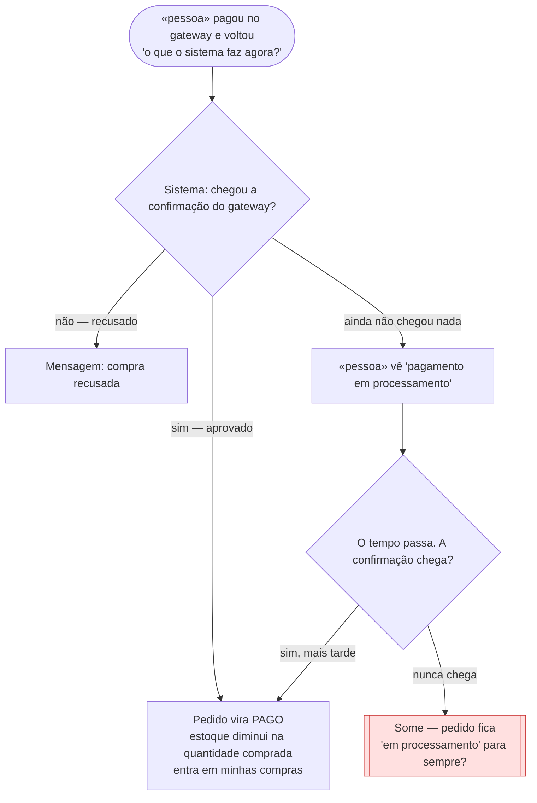

# 🗺️ Jornadas de Usuário

**Projeto:** GameVault (nome provisório = nome do repositório)
**Versão:** 0.1.1 · rascunho completo (não commitado)
**Última atualização:** 2026-09-13

> 🤖 **Este documento é a fonte da verdade sobre O QUE A PESSOA VIVE na tela** —
> o caminho do primeiro clique até o objetivo, e principalmente os pontos onde ela
> trava, espera ou desiste.
>
> ✍️ Completo via `/utf-flows` — diagramas com nós vermelhos e parágrafos de decisão
> escritos pelo aluno.
>
> 🚫 **Não duplique:** regra de negócio mora no `prd.md`; estado, entidade e contrato
> moram no `architecture.md`. Aqui mora o caminho.

---

## Jornada 1 — Finalizar o pedido (US05)

**Story:** US05 — Fazer o pedido (checkout) · `Must Have` · `M`
**Critérios que ela marca:** sai do site e volta · depende do tempo · pode ser abandonada

**O que decidimos sobre o nó vermelho:**

O pedido não depende do retorno do usuário. Mesmo que ele feche a aba e não volte para a loja, o sistema permanece à espera da resposta do gateway e processa o pagamento normalmente quando ela chegar. O pedido só fica `AGUARDANDO PAGAMENTO` porque o sistema ainda não recebeu a confirmação — não porque o usuário abandonou.

---

## Jornada 2 — Confirmação do pagamento (US06)

**Story:** US06 — Pagamento confirmado · `Must Have` · `M`
**Critérios que ela marca:** sai do site e volta · depende do tempo · depende de outra pessoa agir (o gateway) · pode ser abandonada

**O que decidimos sobre o nó vermelho:**

Se a confirmação do gateway não chegar em até 3 horas, o sistema dá a tentativa de pagamento como expirada: informa o usuário de que nenhuma resposta de pagamento foi recebida e o orienta a tentar novamente. O pedido não fica "em processamento" para sempre — ele termina em um estado reconhecível.

---

## 🛠️ 5. Histórico

| Data | Versão | O que mudou |
| :--- | :----- | :---------- |
| 2026-09-13 | 0.1.1 | Parágrafos de decisão dos nós vermelhos (Jornadas 1 e 2) escritos pelo aluno |
| 2026-09-13 | 0.1.0 | Rascunho em entrevista — diagramas das Jornadas 1 (US05) e 2 (US06) |